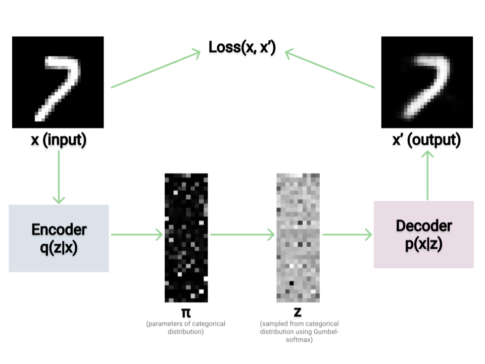

# PyTorch Categorical VAE with Gumbel-Softmax

<a href="ttps://colab.research.google.com/drive/1nGoz0mOA85X04xzn-EfudDTv2_Co1qM1">
    
</a>



This repository contains code for training a variational autoencoder with categorical latents on the MNIST dataset. It's meant to accompany this blog post: https://jxmo.io/posts/variational-autoencoders

The training can also be visualized through Weights and Biases, like in this run here: https://wandb.ai/jack-morris/categorical-vae/runs/36nfcetj. Weights & Biases is a really nice tool that lets you visualize loss curves, gradients, and auto-encoded images and see how they change across training.

Model code (including code for the Gumbel-softmax trick) is in `models.py`. Training code (including the KL divergence computation) is in `train.py`. To run the thing, you can just type:
```python train.py```

(You'll need to install numpy, torchvision, torch, wandb, and pillow to get things running.)